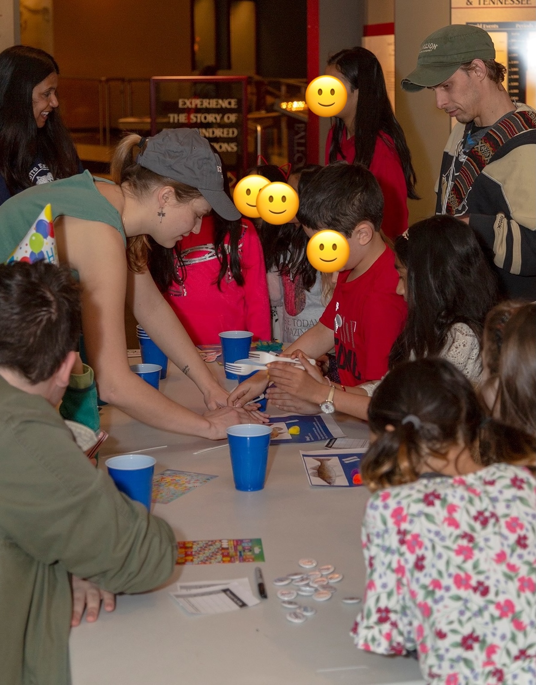

```{=html}
<style>
  /* this just styles the big page title */
  #header h1.title {
    text-align: center;
    font-size: 2.5rem !important;
    margin-top: 0.5rem;
  }
</style>
```

Getting others involved in or just plain excited about ecological research is important to me. I also really enjoy it! Check out some of my favorite experiences below, and for a more complete list, please see my CV.

## Mentorship
<figure class="figure-left">
  
  <figcaption style="font-weight:600; font-size:1.15rem; line-height:1.25;">
    Claire and REU mentee Andrea Torres on a rainy day in the field (on Andrea's birthday!)
    (Savannah River Site, South Carolina)
  </figcaption>
</figure>

I have served as the primary research mentor for two undergraduate students while at CU. I guided these students through their first research experiences in ecology, encompassing the whole research process from field work, lab work, data analysis, and sharing their science (both as a talk and a poster, and for my mentee Andrea, as a co-author on our soon-to-be-submitted bioaerosol paper!). Our research together has been funded by the National Science Foundation, specifically through the programs [Research Experience for Undergraduates (REU)](https://www.nsf.gov/funding/initiatives/reu) and the [Research Experience for Community College Students (RECCS)](https://ceee.colorado.edu/programs/reccs).

An additional highlight of time in graduate school has been helping get CU's chapter of Strategies for Ecology Education, Diversity and Sustainability (SEEDS) off the ground in 2021 as one of the graduate student advisors to the new chapter! [SEEDS](https://esa.org/seeds/) is supported by the Ecological Society of America (ESA) and aims to diversify and advance ecology by providing hands-on opportunities for undergraduates from under-represented groups to get involved in ecology. 

## Science Communication
<figure class="figure-left">
  
  <figcaption style="font-weight:600; font-size:1.15rem; line-height:1.25;">
    Giving a talk about soil ecology and soil health at the Knoxville Earth Day Fest
  </figcaption>
</figure>

I am passionate about engaging non-students in ecological research, too! 

As academic ecologists we often state that a goal of our research is to 'inform policy'. But this can be easier said than done—our research papers are primarily written for other ecologists, and are often not the most accessible to policymakers and boots-on-the-ground conservationists! For this reason, I've contributed to [Conservation Corridor](https://conservationcorridor.org), a website that translates the newest research on landscape and connectivity science into plain language research summaries. You can check out the digests I've written on my own work and that of others [here](https://conservationcorridor.org/author/claire-winfrey/)!

I've also given public talks about my research and other topics in ecology, in venues ranging from the Great Smoky National Park as a Part of their <em>Science at Sugarlands</em> series to the Knoxville Earth Day Fest! 

## Other Outreach
<div class="img-row">
  <figure>
    
    <figcaption>Teaching kids about evolution at the McClung Museum!</figcaption>
  </figure>
  <figure>
    
    <figcaption>Showing kids dust and pollen under the microscope at the National Western Stock Show in Denver!</figcaption>
  </figure>
  <figure>
    
    <figcaption>Spreading the word about Charles Darwin for Darwin Day at the University of Tennessee!</figcaption>
  </figure>
</div>

<style>
.img-row {
  display: flex;
  flex-wrap: wrap;        /* allow wrapping on narrow screens */
  gap: 20px;              /* space between items */
  justify-content: center;
  margin-top: 15px;       /* extra space above row */
  margin-bottom: 15px;    /* extra space below row */
}

.img-row figure {
  flex: 0 1 30%;          /* target ~4 per row */
  max-width: 30%;
  margin: 0;              /* reset default figure margin */
  text-align: center;     /* center captions under images */
}

.img-row img {
  width: 100%;            /* image fills its figure */
  height: auto;           /* keep aspect ratio */
  border-radius: 9px;     /* optional rounded corners */
  display: block;         /* remove inline spacing under image */
  margin-bottom: 6px;     /* space between image and caption */
}

.img-row figcaption {
  font-size: 1.15rem;       /* slightly smaller text */
  font-weight:600;            
  line-height:1.25;
}

/* Mobile responsiveness */
@media (max-width: 600px) {
  .img-row figure {
    flex: 0 1 100%;       /* full width on small screens */
    max-width: 100%;
  }
}
</style>

<!-- 🍄 Mushroom: drop-in HTML+CSS+JS -->
<div id="mushroom" class="mushroom" role="img" aria-label="wandering mushroom" title="click me">
  <svg viewBox="-40 -40 80 80" width="80" height="80" aria-hidden="true">
    <!-- Cap -->
    <g class="cap">
      <ellipse cx="0" cy="-8" rx="22" ry="14"
               fill="#8B4513" stroke="#4a2a12" stroke-width="2"/>
      <!-- Cute dots -->
      <circle cx="-8" cy="-10" r="3" fill="#fff7e6"/>
      <circle cx="6" cy="-12" r="2.5" fill="#fff7e6"/>
      <circle cx="10" cy="-6" r="2" fill="#fff7e6"/>
    </g>
    <!-- Stem -->
    <g class="stem">
      <rect x="-6" y="-8" width="12" height="24" rx="6" ry="6"
            fill="#f5deb3" stroke="#c2a671" stroke-width="2"/>
    </g>
    <!-- Face -->
    <g class="face">
      <circle cx="-3" cy="2" r="2.2" fill="#000"/>
      <circle cx="3" cy="2" r="2.2" fill="#000"/>
      <circle cx="-2.5" cy="1.5" r="0.8" fill="#fff"/>
      <circle cx="3.5" cy="1.5" r="0.8" fill="#fff"/>
      <path d="M -3 6 Q 0 9 3 6" stroke="#000" stroke-width="1.5" fill="none" stroke-linecap="round"/>
    </g>
  </svg>
</div>

<style>
.mushroom {
  position: fixed; top: 0; left: 0;
  width: 80px; height: 80px;
  transform-origin: 50% 50%;
  z-index: 9999;
  cursor: pointer;
  pointer-events: auto;
  will-change: transform;
}

/* Glow when squirming */
.mushroom.is-squirming .cap {
  filter: drop-shadow(0 0 8px rgba(150, 80, 20, 0.6));
}

@media (prefers-reduced-motion: reduce) {
  .mushroom { position: static; }
}
</style>

<script>
(() => {
  const prefersReduced = window.matchMedia &&
        window.matchMedia('(prefers-reduced-motion: reduce)').matches;
  const el = document.getElementById('mushroom');
  if (!el || prefersReduced) return;

  const size = 80, half = size / 2;
  let w = window.innerWidth, h = window.innerHeight;

  // Start random-ish
  let x = Math.random() * w, y = Math.random() * h;
  let angle = Math.random() * Math.PI * 2;

  const baseSpeed = 60;       // px/sec
  let speed = baseSpeed;
  const turnRate = 1.0;       // radians/sec
  const margin = half + 8;
  let squirmUntil = 0;

  let last = performance.now();

  function frame(now) {
    const dt = Math.min(50, now - last);
    last = now;

    // Wander steering
    angle += (Math.random() - 0.5) * (turnRate * dt / 1000);
    angle += 0.25 * Math.sin(now / 1400) * (dt / 1000);

    // Move
    const v = speed * (dt / 1000);
    x += Math.cos(angle) * v;
    y += Math.sin(angle) * v;

    // Bounce off edges
    if (x < margin) { x = margin; angle = Math.PI - angle; }
    if (x > w - margin) { x = w - margin; angle = Math.PI - angle; }
    if (y < margin) { y = margin; angle = -angle; }
    if (y > h - margin) { y = h = h - margin; angle = -angle; }

    // Reset squirm
    if (now > squirmUntil && speed !== baseSpeed) {
      speed = baseSpeed;
      el.classList.remove('is-squirming');
    }

    // Position
    el.style.transform =
      `translate3d(${(x - half).toFixed(1)}px, ${(y - half).toFixed(1)}px, 0) ` +
      `rotate(${(angle * 180 / Math.PI).toFixed(1)}deg)`;

    requestAnimationFrame(frame);
  }

  requestAnimationFrame(frame);

  window.addEventListener('resize', () => { w = window.innerWidth; h = window.innerHeight; });

  // Click squirm
  const squirm = () => {
    el.classList.add('is-squirming');
    speed = baseSpeed * 2.0;
    squirmUntil = performance.now() + 900;
  };
  el.addEventListener('pointerdown', squirm, { passive: true });
})();
</script>
