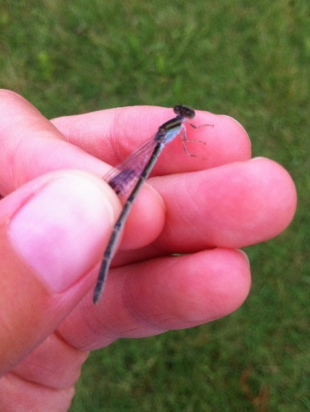

```{=html}
<style>
  /* this just styles the big page title */
  #header h1.title {
    text-align: center;
    font-size: 2.5rem !important;
    margin-top: 0.5rem;
  }
</style>
```

## Dissertation Research
<style>
.centered-img {
  display: block;
  margin: 1rem auto;   /* centers horizontally */
  max-width: 1000px;   /* max width */
  width: 100%;         /* scales down on small screens */
  height: auto;
}
</style>

<figure class="centered-figure">
  
  <figcaption style="font-weight:600; font-size:1.15rem; line-height:1.25;">
    Most of my dissertation field research took place in the Corridor Project experimental landscapes at the Savannah River Site, SC, and I'm grateful to Team Corridor and the U.S. Forest Service for making it happen! Photo: Andrea Torres
  </figcaption>
</figure>

### Habitat specialization and edge effects of soil microbial communities in a fragmented landscape [(Winfrey, Resasco & Fierer, 2025)](https://esajournals.onlinelibrary.wiley.com/doi/full/10.1002/ecy.70072)
<figure class="figure-left">
  
  <figcaption style="font-weight:600; font-size:1.15rem; line-height:1.25;">
    Open patch with forested matrix in background
    (Savannah River Site, South Carolina)
  </figcaption>
</figure>

While edge effects caused by habitat fragmentation have been well documented in plants and animals, whether or not soil bacteria, archaea, and fungi exhibit edge effects is an open question. Given the central role of microorganisms as drivers of soil ecosystem services, examining the responses of soil microorganisms to edge effects is important initial step for understanding how soil functioning may be impacted by habitat fragmentation. 

Motivated by this knowledge gap, we used 16S and ITS rRNA gene sequencing to survey the spatial distributions of soil bacteria, archaea, and fungi communities in replicate ~1 hectare open patches surrounded by forested plantation matrix in South Carolina, USA. We discovered that the greater the vegetation contrast between the patch and the matrix, the more pronounced was the microbial turnover across the edge and more distinct were patch and matrix communities. These observed edge effects were driven mostly by taxa that specialized in the open patch or the forested matrix; there were very few taxa that preferred edge habitat. We next explored if phylogeny or life history traits might distinguish taxa that responded to the edge from generalist taxa. We did not find support for our hypotheses that generalist taxa would be more likely to sporulate or have larger genomes (associated with greater metabolic versatility). However, we did find that Chloroflexi and arbuscular mycorrhizal fungi strongly preferred the open patch over matrix or edge habitat, suggesting that they may be particularly vulnerable to fragment edges. 

See the 'digest' of this research that I wrote for [<em>Conservation Corridor</em>](https://conservationcorridor.org/digests/2025/05/habitat-fragmentation-and-edges-matter-for-soil-microorganisms/)!

### The sources and traits of bacteria and fungi found in the near-surface atmosphere. (Paper to be submitted soon!)
<div class="figure-stack-left">
  <figure>
    
    <figcaption style="font-weight:600; font-size:1.0rem; line-height:1.25;">
      REU student Andrea Torres and bioaerosol sampler above!
    (Savannah River Site, South Carolina)
    </figcaption>
  </figure>
  <figure>
    
    <figcaption style="font-weight:600; font-size:1.0rem; line-height:1.25;">
      Fungi within the genus <em>Trametes</em> were among the most abundant in bioaerosols! 
    </figcaption>
  </figure>
</div>

<style>
.figure-stack-left {
  float: left;
  margin: 0 1em 0.0em 0;   /* ↓ smaller bottom margin for the whole stack */
  max-width: 250px;
}

.figure-stack-left figure {
  margin: 0 0 0.5em 0;       /* ↓ smaller spacing between the two images */
  text-align: center;
}

.figure-stack-left figure:last-child {
  margin-bottom: 0;          /* no extra gap under the stack */
}

.figure-stack-left img {
  width: 100%;
  height: auto;
  border-radius: 6px;
  display: block;            /* avoids tiny baseline gap under images */
}

.figure-stack-left figcaption {
  margin: 0.35em 0 0;        /* small space above caption, none below */
}
</style>


High UV, rapidly fluctuating temperatures, and few nutrients make the atmosphere a harsh place for microorganisms. Yet, diverse fungi, bacteria, archaea, and protists are found in the near-surface atmosphere (i.e., the 'aeromicrobiome'), with transport through the atmosphere long hypothesized to explain the continental or even global ranges of some microbes. 

This project asks three unresolved, key questions in aeromicrobiology, working at habitat boundaries (where savanna-like patches and a forest matrix meet) and a spatial scale of ~100 meters to investigate the influence of local plants and soils on the aeromicrobiome. A better understanding of the aeromicrobiome at ecosystem edges may lead to improved predictions for microbial dispersal and spillover in the context of widespread and increasing habitat fragmentation worldwide.

Questions I addressed in this project: (1) Is the plant community type important for driving differences in the aeromicrobiome at small scales? (2) Which, if any, microbes are shared between the air and local plants and soils? (3) Are there microbial traits that distinguish aerosolized microbes from those in the soil or plant source environments?

<p>
  Check out my recent CIRES Rendezvous poster of this work here:  
  <a href="assets/img/RendezvousPoster_2025.pdf" target="_blank" rel="noopener noreferrer">
    
    Open PDF
  </a>
</p>


<div class="clear-below"></div>
<h3 style="clear: both; margin-top: 0em;">The diversity and distribution of soil bacteria capable of forming spore-like structures. (in preparation)</h3>

<figure class="figure-left">
  
  <figcaption style="font-weight:600; font-size:1.15rem; line-height:1.25;">
    Some of the cyanobacterial cells within this biological soil crust are likely akinetes. Akinetes are are dormant, spore-like structures that some cyanobacteria produce to survive dry, harsh conditions.
    (Savannah River Site, South Carolina)
  </figcaption>
</figure>

Environmental characteristics that shape bacterial communities, such as pH, moisture, and the availability of carbon and nutrients, are highly patchy both temporally and spatially in soil. How do soil bacteria survive harsh conditions where they live or survive the journey to patches of soil where conditions are better? Ample research has shown that some bacterial taxa armor themselves in tough spore-like structures in response to conditions unfavorable for growth. However, such a strategy should be adaptive for more than just these few phyla that we know independently evolved and form different types of spores.

In this project, I address four questions: (1) which soil bacteria form spore-like structures? (2) are these identified spore-forming bacteria more ubiquitous than non-spore-forming bacteria in soil? (3) How do spore-forming bacteria vary across ecosystems and environmental gradients? And (4) are spore-forming soil bacteria more readily dispersed in the near-surface atmosphere? To address these questions, I combine a culture-independent enrichment approach and marker-gene sequencing to classify putative spore-formers and non-spore formers directly in their soil environment.

## Other Research
<div class="img-row">
  <figure>
    
    <figcaption></figcaption>
  </figure>
  <figure>
    
    <figcaption></figcaption>
  </figure>
  <figure>
    
    <figcaption></figcaption>
  </figure>
</div>

<style>
.img-row {
  display: flex;
  flex-wrap: wrap;        /* allow wrapping on narrow screens */
  gap: 20px;              /* space between items */
  justify-content: center;
  margin-top: 15px;       /* extra space above row */
  margin-bottom: 15px;    /* extra space below row */
}

.img-row figure {
  flex: 0 1 30%;          /* target ~4 per row */
  max-width: 30%;
  margin: 0;              /* reset default figure margin */
  text-align: center;     /* center captions under images */
}

.img-row img {
  width: 100%;            /* image fills its figure */
  height: auto;           /* keep aspect ratio */
  border-radius: 9px;     /* optional rounded corners */
  display: block;         /* remove inline spacing under image */
  margin-bottom: 6px;     /* space between image and caption */
}

.img-row figcaption {
  font-size: 1.15rem;       /* slightly smaller text */
  font-weight:600;            /* grey for subtlety */
  line-height:1.25;
}


/* Mobile responsiveness */
@media (max-width: 600px) {
  .img-row figure {
    flex: 0 1 100%;       /* full width on small screens */
    max-width: 100%;
  }
}
</style>
### Do biogeographical 'rules' apply to microorganisms? [(Dickey et al., 2021)](https://www.frontiersin.org/journals/ecology-and-evolution/articles/10.3389/fevo.2021.633155/full)
Macroecological 'rules' are a series of patterns that essentially summarize our current understanding of biogeography. Based on centuries of observations of animals and plants, these 'rules' describe the relationships between distribution on the Earth's surface (e.g., latitude, area, temperature) to organismal traits or community assembly and biodiversity. However, our knowledge of if these rules apply to the majority of species on Earth--the largely unseen bacteria, archaea, and fungi--is only now starting to become clear. In this paper, we perform a literature meta-analysis to assess how well microorganisms conform to biogeographical patterns, considering aquatic and terrestrial systems as well as host-assoicated and free-living microbes. Along with Anchal Padukone, I wrote the Island Biogeography section!

### Do male damselflies males use senses other than visual to detect their mates? [(Winfrey & Fincke, 2017)](https://www.tandfonline.com/doi/abs/10.1080/13887890.2017.1297259)
Because damselflies are speciose, have radiated recently, and have complex mating behaviors, damselflies are model organisms for studies of sexual selection and sexual conflict. Most of this work to date operates under the assumption that males use only visual cues to detect and identify mates. Our research was the first to test this assumption in the field, finding that males do not orient to females without visual cues. 

### How prevalent is Batrachochytrium dendrobatidis (Bd) among amphibians in Southern Oklahoma? [(Marhanka et al. 2017)](https://cameronsiler.com/detection-of-high-prevalence-of-batrachochytrium-dendrobatidis-in-amphibians-from-southern-oklahoma/)
Batrachochytrium dendrobatidis (Bd, often called chytrid for short) has caused massive declines in amphibian populations worldwide. Research supports that the prevalence and lethality of Bd worldwide is on the rise, due to human-mediated spread of the fungus and warmer global temperatures, respectively. However, despite the threat of this fungus and Oklahoma's high amphibian biodiversity, only 4 isolated sites had been sampled for Bd in Oklahoma prior to this work.  For this project, we sampled 14 sites across Southern Oklahoma for frogs and salamanders. All amphibian families, all sampling locations, and 15/18 species were Bd +, although locations and species differed in their pathogen loads.

### Describing a new species of Philippine Slender Skink (Brachymeles bonitae complex) [(Davis et al. 2016)](https://cameronsiler.com/additions-to-philippine-slender-skinks-of-the-brachymeles-bonitae-complex-iii/)
Philippine skinks of the genus Brachymeles are a fascinating group with varying degrees of limb and digit loss that are thought to help them adapt to specific challenges in their environment. Work lead by Dr. Cameron Siler has discovered many cryptic species within Brachymeles, with additional evidence that more cryptic species are present within the B. bonitae complex. This project reports formal description of a new species of fossorial skink within the Brachymeles bonitae complex found on Tablas Island in the Philippines, based on collections made over 50 years ago. This work is near and dear to my heart, as it was the first scientific paper I contributed to. I appreciate Dr. Siler giving me and the other undergraduates on this project an opportunity to publish!