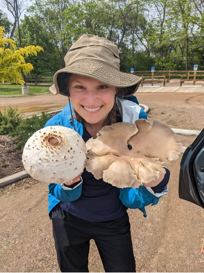

```{=html}
<style>
  /* override the Rmd header title, so that title formatted even if site CSS not loaded */
  #header h1.title { 
    text-align: center; 
    font-size: 2.5rem !important; 
    margin-top: 0.5rem; 
  }
</style>
```

<figure class="figure-left">
  
  <figcaption style="font-weight:600; font-size:1.15rem; line-height:1.25;">
    Claire Winfrey
    claire.winfrey(at)colorado.edu
  </figcaption>
</figure>

Hi! I am an ecologist broadly interested in the biogeography and dispersal of microorganisms, with a special love for understanding the soil fungi and bacteria that are so integral to soil health. Relatedly, I am also fascinated by host-microbiome relationships and how these may scale up to affect ecosystem functioning. Other than my research, I enjoy exploring Colorado’s mountains every way I can, gardening native plants, crafting, and reading nerdy books.

I am a PhD candidate co-advised by Noah Fierer and Julian Resasco at the University of Colorado Boulder in the Department of Ecology and Evolutionary Biology. Currently, I am also a Graduate Research Award Fellow through the Cooperative Institute for Research in Environmental Sciences (CIRES). My dissertation research focuses on the spatial patterns of microorganisms in the soil and near-surface atmosphere, considering physiological traits and environmental conditions including habitat fragmentation to understand why microbes are where they are. 

<div class="clearfix"></div>
